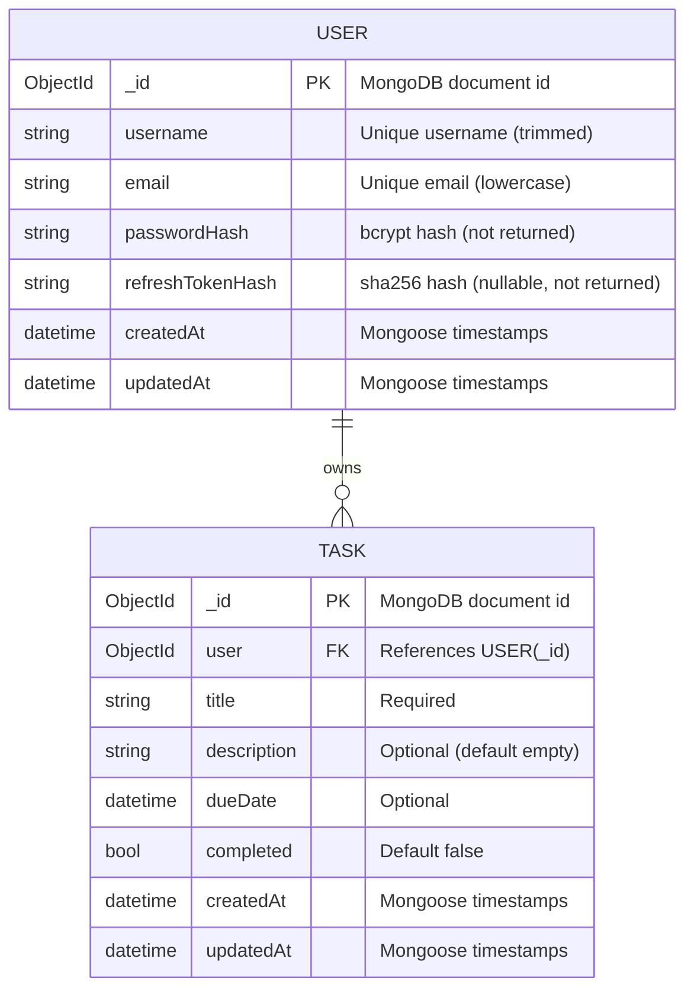

Copyright © 2024-2025 Q2O - Quick to Objective AI Development Platform
Created by: CryptoLavar (Project Architect & Developer) cryptolavar@gmail.com

<!-- Role: Index (Database Engineer - MongoDB) -->

# Database Model (ERD) - Yearly Planner

## Back to Root README

`../README.md`

## Overview

This repository uses MongoDB (via Mongoose). The data model currently implemented in code consists of:
- `User`
- `Task`

Projects and comments are not implemented in the current codebase as of 2025-12-18.

## ERD (implemented)

## Collection notes (implementation-aligned)

### Users

- `username` is unique and trimmed.
- `email` is unique and lowercased.
- `passwordHash` and `refreshTokenHash` are intentionally removed from JSON responses.

### Tasks

- Every task has a required `user` reference.
- A basic index exists on `Task.user` for user-scoped queries.

## Operational notes

- If the database already contains legacy users with a plaintext `password` field (from earlier versions), a migration/reset plan is required for those accounts to authenticate under the current model.

<!-- Signed-off-by: Index (Database Engineer - MongoDB) -->